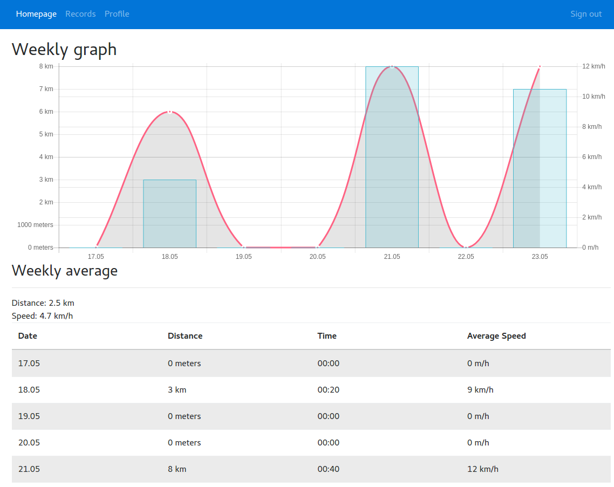

# Learning Purposes

Learning purpose, tring to work with [Feathers](https://feathersjs.com/)
Next project using AngularJS and Bootstrap 4 styling.



## Getting Started

1. Make sure you have [NodeJS](https://nodejs.org/) and [npm](https://www.npmjs.com/) installed.
2. Install your dependencies & build the static files

```
npm install
npm run build
```

3. Start your app
```
npm start
```

If you want to use production config - run `export NODE_ENV=production`

## Testing

Simply run `npm run mocha`.
You have to `cp test/config.default.js test/config.js` and update `test/config.js` before the run.
